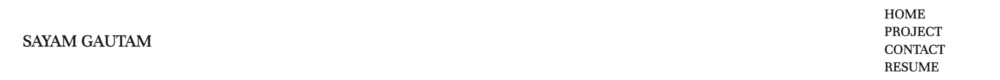

# Sayam Gautam Portfolio

# Sayam-Gautam-Profesional-Portfolio

[Portfolio website](https://sayamgautam1.github.io/portfolio_v2/)

## Description

This is my second take on working on the portfolio, adding some of the projects i have done after making my first portfolio website.

# Purpose

To achieve the said task given 
AS AN employer 
I WANT to view a potential employee's deployed portfolio of work samples 
SO THAT I can review samples of their work and assess whether they're a good candidate for an open position 

# Features

When loded the portfoli you can see my resume with the sample of all my previous work. 
You are presented with my name, a recent photo, links to the sections inside the document, my work and how to contact me. 
When cliked on the links in the nav bar it scolls to the particular section. 
When clicked on a particular section the UI scrolls to the said section. 
When seeing any project/work the UI is bigger compared to other said project.  
When clicking on an application it takes you the said application.  
When resizing the media is responsive.

# Built With

HTML

CSS

BOOTSTRAP

Font awesome
